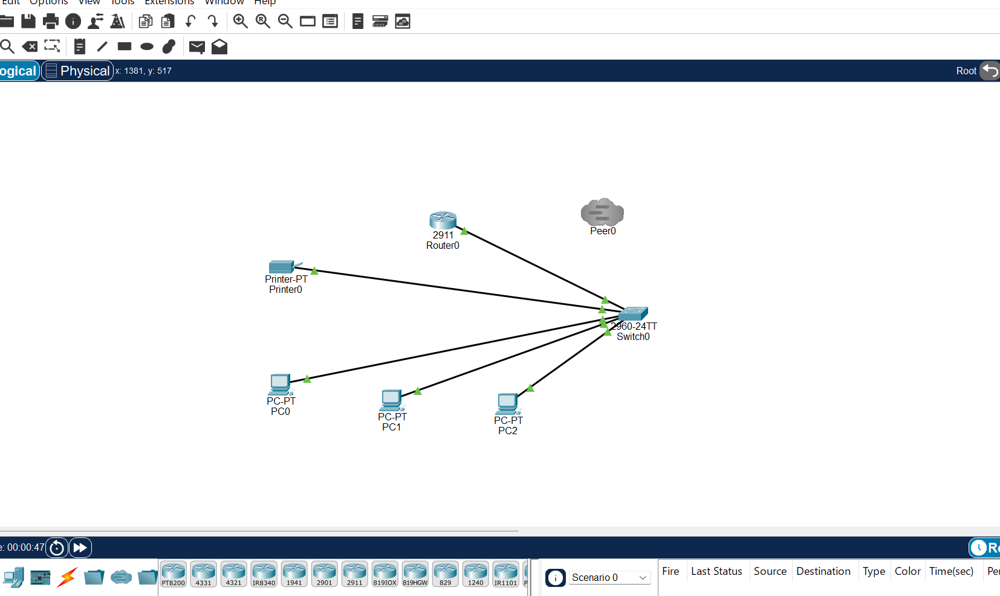

# Small office Network

This is my first networking project using Cisco packet tracer. i built a small office network with 3 PCs, a printer, a switch and a router.

## Equipment used
- 3 PCs
- Network printer
- Cisco 2960 Switch
- Cisco 2911 Router
- Ethernet cables

## IP Addressing
- Router 192.168.1.1
- PC1 192.168.1.10
- PC2 192.168.1.11
- PC3 192.168.1.12
- Printer 192.168.1.20

Subnet Mask 255.255.255.0 (/24)

## Network Testing
i used the ping command in Cisco packet tracer to test the connections between devices.
All ping test were successful, confirming that the devices could communicate across the network.

## Skills Learned
- Building a Local Area Network (LAN)
- Configuring IPV4 addresses
- Understanding Routers and Switches
- Setting up a Default gateway
- Connecting a shared network printers
- Testing connections using ping
- Basic network troubleshooting

## Future Improvements
I plan to expand my small office network as i learn more about Networking and Cybersecurity.
Future improvements will include:
- Adding more computers
- setting up a DHCP server
- Creating VLANS
- ADDING wireless devices
- Improving network security
